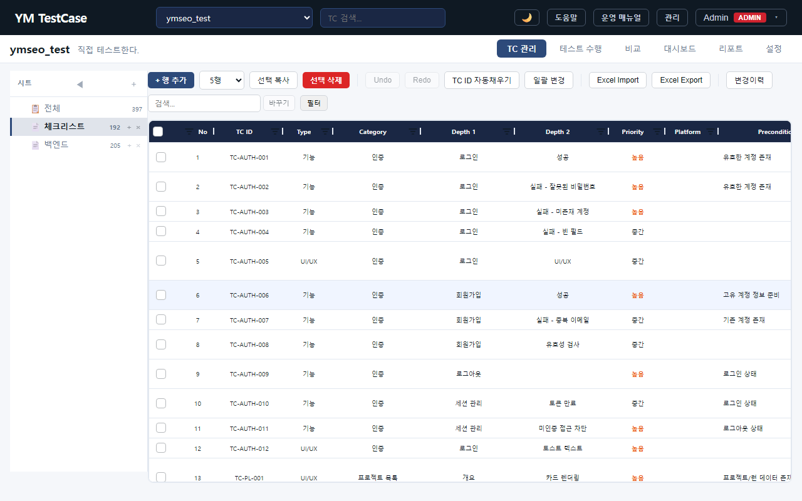
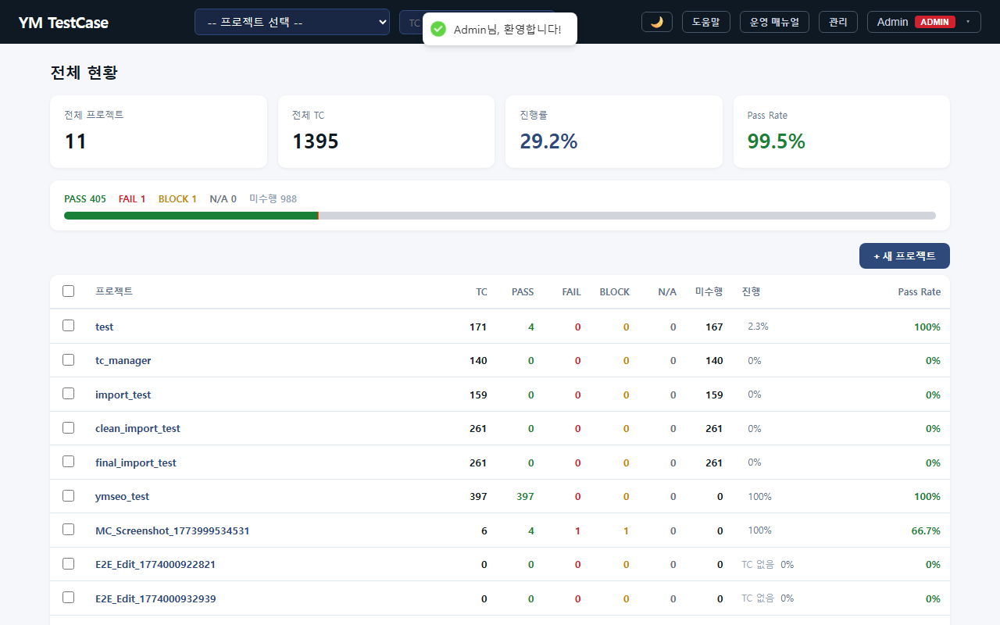
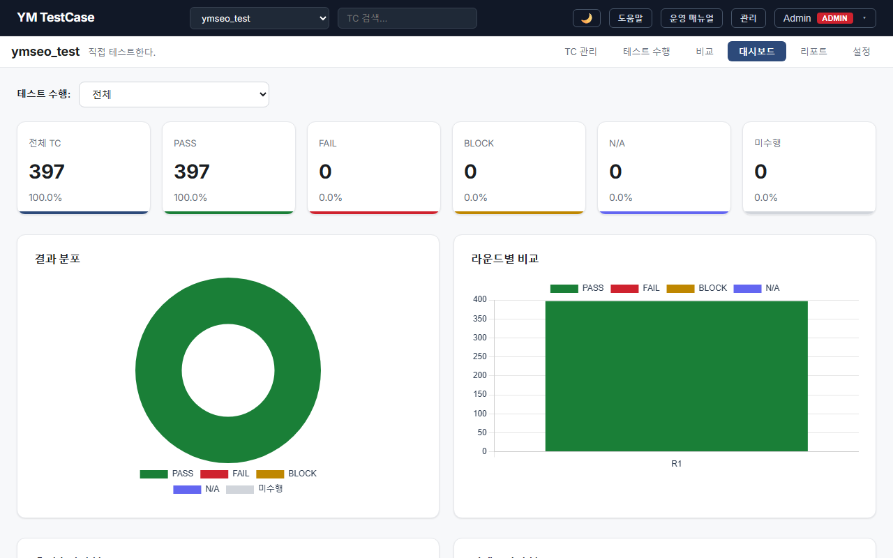
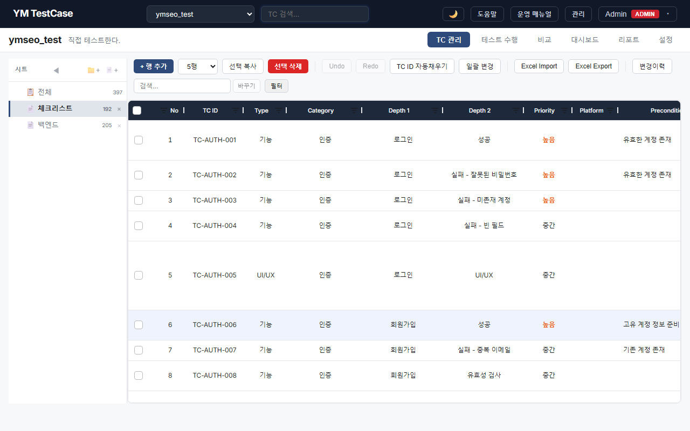
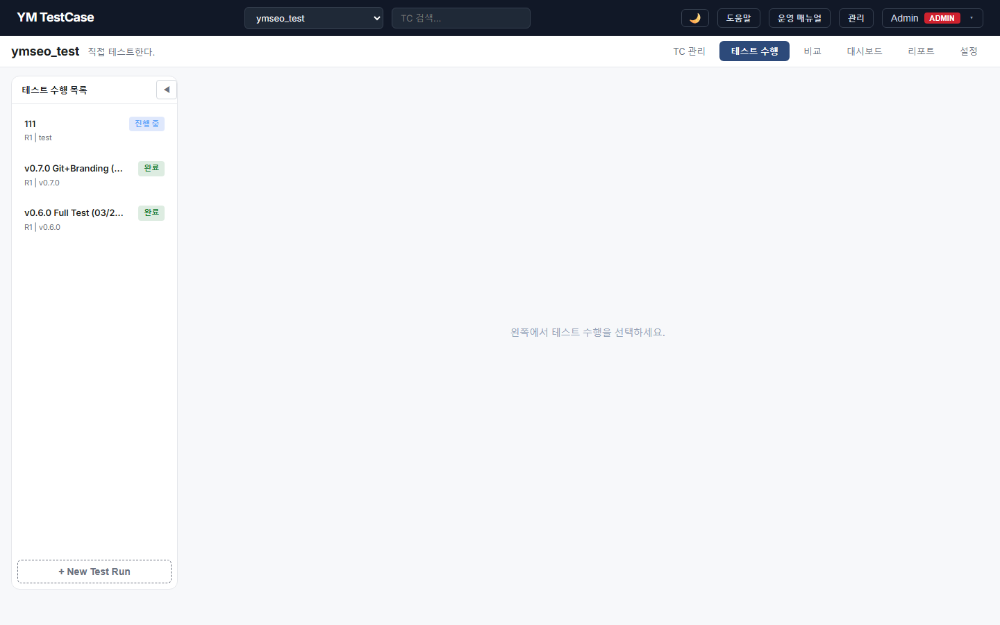
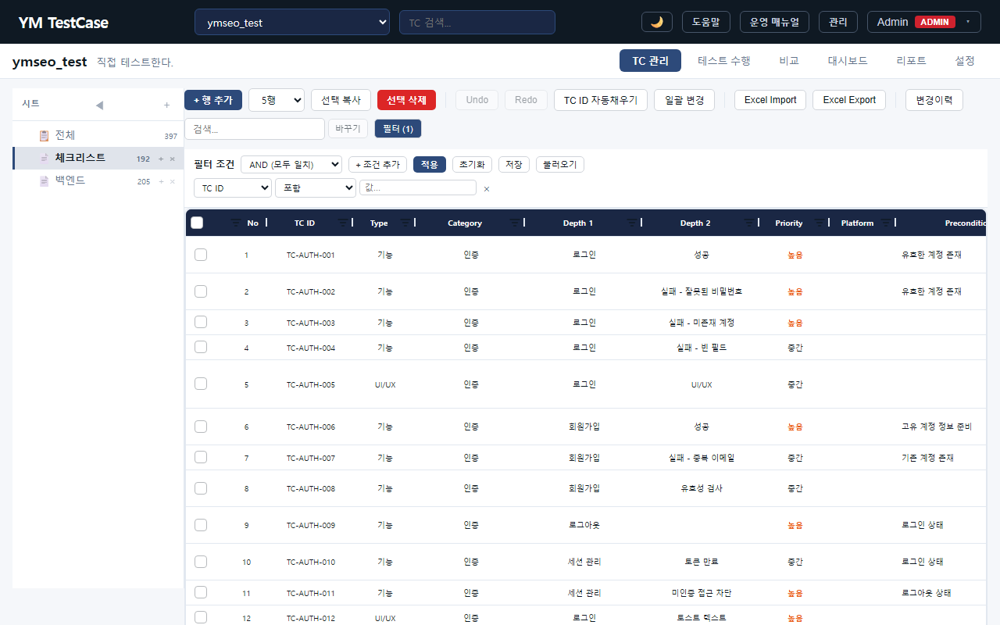
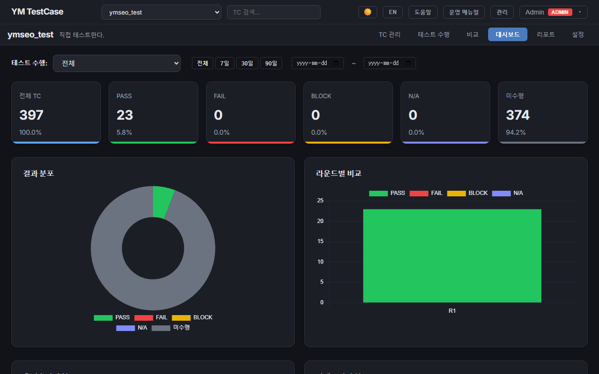

# YM TestCase

> **Y**our **M**ethod, Your Test Case Manager

QA 팀과 개발팀을 위한 셀프 호스팅형 테스트케이스 관리 도구.
TestRail · Kiwi TCMS 대안으로, **작성 → 실행 → 집계 → 리포트**를 한 곳에서 관리합니다.

- **빠르게 작성** — 스프레드시트 스타일 그리드로 TC를 즉시 편집
- **실행 결과 추적** — 테스트 런 · 플랜 · 대시보드로 진행률을 한눈에
- **팀 프로세스에 맞춤** — 역할 기반 접근 제어, 커스텀 필드, 고급 필터



|  |  |
|---|---|
| **프로젝트 목록** — 현황 및 진행률 | **대시보드** — 통계 한눈에 |

## 기존 도구와의 비교

<table>
<thead>
<tr><th>기존 방식</th><th>YM TestCase</th></tr>
</thead>
<tbody>
<tr><td>스프레드시트로 TC 관리 → 버전 충돌, 통계 불가</td><td><b><a href="#">웹 기반 실시간 편집, 자동 집계</a></b></td></tr>
<tr><td>상용 도구(TestRail 등) → 비용, 셀프호스팅 불가</td><td><b><a href="#">무료 오픈소스, 셀프호스팅 가능</a></b></td></tr>
<tr><td>자체 개발 → 구축 기간, 유지보수 부담</td><td><b><a href="#">설치 즉시 사용 가능, AGPL-3.0 라이선스</a></b></td></tr>
</tbody>
</table>

## 설치 및 실행

> **Tip**: AI Agent에게 이 레포지토리 주소를 알려주고 README 문서대로 설치할 것을 요청하면 더 쉽게 설치가 가능합니다.

### 1. 사전 요구사항

- [Python 3.11+](https://www.python.org/downloads/)
- [Node.js 18+](https://nodejs.org/)
- [Git](https://git-scm.com/)

### 2. 소스 코드 다운로드

```bash
git clone https://github.com/sym804/ym-testcase.git
cd ym-testcase
```

### 3. 환경변수 설정

```bash
cp backend/.env.example backend/.env
```

복사한 `backend/.env` 파일을 열어서 **SECRET_KEY를 반드시 변경**하세요:

```dotenv
# 변경 전 (기본값 — 이대로 쓰면 안 됩니다)
SECRET_KEY=change-me-to-a-random-string

# 변경 후 (아무 랜덤 문자열로 교체)
SECRET_KEY=my-super-secret-key-abc123xyz
```

> **왜 바꿔야 하나요?** 이 키는 로그인 토큰 암호화에 사용됩니다.
> 기본값 그대로 두면 서버를 재시작할 때마다 **로그인이 풀립니다.**

나머지 설정은 기본값으로 동작하므로 로컬 개발 시 수정할 필요 없습니다.
상세한 설정 항목은 `backend/.env.example` 파일의 주석을 참고하세요.

### 4. 서버 실행

**백엔드** (터미널 1):
```bash
cd backend
pip install -r requirements.txt
uvicorn main:app --reload --port 8008
```

**프론트엔드** (터미널 2):
```bash
cd frontend
npm install
npm run dev
```

브라우저에서 http://localhost:5173 접속 → 첫 번째로 가입하는 사용자가 자동으로 **admin** 권한을 받습니다.

## 주요 기능

| 기능 | 설명 |
|---|---|
| 스프레드시트 TC 편집 | ag-grid 기반 인라인 편집, 다중 행 추가, 벌크 삭제 |
| 시트 트리 구조 | N-depth 계층형 Test Suite 관리 |
| 커스텀 필드 | text, number, select, multiselect, checkbox, date |
| 테스트 런 | 실행 결과 기록, 진행률 추적, 재실행 |
| 테스트 플랜 | 릴리즈 단위 수행 관리, 마일스톤별 진행률 |
| 대시보드 | 프로젝트별 통계 차트 (Chart.js) |
| 고급 필터 | AND/OR 다중 조건, 필터 저장/불러오기 |
| Import/Export | Excel(xlsx), Jira CSV, PDF 리포트 |
| 접근 제어 | 시스템 역할 + 프로젝트 역할 이중 구조 |
| 보안 | httpOnly 쿠키 인증, CSRF 보호, Rate Limiting, bcrypt |

## 스크린샷

<details>
<summary>더 보기</summary>

### 프로젝트 목록


### TC 관리 (스프레드시트 스타일)


### 시트 트리 구조


### 테스트 수행 결과


### 고급 필터


### 다크 모드


</details>

## 기술 스택

| 구분 | 기술 |
|---|---|
| Frontend | React 19, TypeScript, Vite, ag-grid, Chart.js |
| Backend | Python 3.12, FastAPI, SQLAlchemy, SQLite |
| Test | Vitest (357 tests), Playwright (E2E), pytest |
| Deploy | 셀프호스팅 (로컬 실행) |

## 테스트

```bash
# Frontend 단위 테스트
cd frontend && npm run test

# Backend API 테스트 (서버 실행 상태에서)
cd backend && python -m pytest -v

# E2E 테스트 (서버 실행 상태에서)
cd frontend && npx playwright test
```

## 프로젝트 구조

```
ym-testcase/
├── backend/          # FastAPI 백엔드
│   ├── main.py       # 앱 엔트리포인트
│   ├── models.py     # SQLAlchemy 모델
│   ├── routes/       # API 라우터 (15 모듈)
├── frontend/         # React 프론트엔드
│   ├── src/
│   │   ├── pages/    # 페이지 컴포넌트
│   │   ├── components/
│   │   └── api/      # API 클라이언트
│   ├── e2e/          # Playwright E2E 테스트
├── backend/.env.example
├── run_dev.bat       # Windows 개발 서버
├── run_dev.sh        # Mac/Linux 개발 서버
└── README.md
```

## 기여하기

기여를 환영합니다! [CONTRIBUTING.md](CONTRIBUTING.md)를 읽어주세요.

## 라이선스

AGPL-3.0 — [GNU Affero General Public License v3.0](LICENSE)

## 만든 사람

| 역할 | 담당 |
|------|------|
| 제품 기획 및 UI 테스트 | **sym804** |
| 풀스택 구현 및 자동화 테스트 | **Claude Code** |
